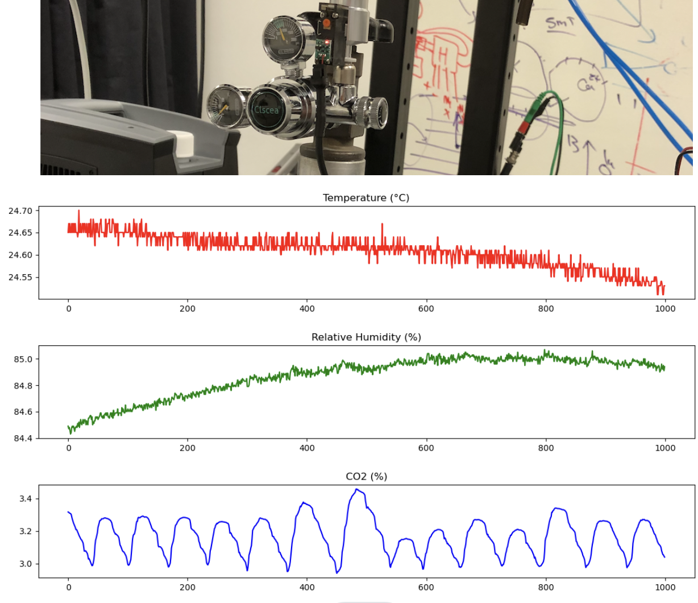

# SCD-30 Carbon Dioxide (CO2) Sensor

## Table of Contents
- [Introduction](#introduction)
- [Features](#features)
- [Hardware Requirements](#hardware-requirements)
- [Plotting Data](#plotting-data)

## Introduction
The SCD-30 Carbon Dioxide (CO2) Sensor, manufactured by Sensirion, is a high-quality Non-dispersive Infrared (NDIR) CO2 sensor with an impressive range of 400 to 10,000 ppm and an accuracy of ±(30 ppm + 3%). It stands out with its integrated temperature and humidity sensors, making it a versatile choice for environmental monitoring. Moreover, the sensor can be calibrated for altitude and is capable of accepting ambient pressure readings, thus enhancing precision. To simplify handling the SCD-30, an Arduino library is available, facilitating the reading of CO2, humidity, and temperature data. This library can be easily obtained through the Arduino Library Manager by searching for "SparkFun SCD30 Arduino Library."

The SCD-30 Humidity and Temperature Sensor is fully compatible with the OpenLog Artemis datalogger system, allowing for automatic detection, scanning, configuration, and data logging, eliminating the need for intricate programming or setup.

## Features
- **Power Supply Voltage:** Operates within the voltage range of 3.3V to 5.5V.
- **NDIR CO2 Sensor Technology:** Utilizes Non-Dispersive Infrared (NDIR) technology for accurate CO2 measurements.
- **Integrated Temperature and Humidity Sensor:** Equipped with built-in sensors for temperature and humidity readings.
- **Dual-Channel Detection:** Offers dual-channel CO2 detection for enhanced stability and precision.
- **Compact Form Factor:** Compact in size, with dimensions measuring 35 mm x 23 mm x 7 mm.
- **Measurement Range:** Capable of measuring CO2 levels within the range of 400 ppm to 10,000 ppm.
- **Accuracy:** Boasts a high level of accuracy, adhering to a specification of ±(30 ppm + 3%).
- **Low Current Consumption:** Operates with low current consumption, only drawing 19 mA at a measurement rate of 1 per 2 seconds.
- **Energy Efficiency:** Designed with energy efficiency in mind, consuming merely 120 mJ per measurement.
- **Fully Calibrated and Linearized:** The sensor data is fully calibrated and linearized, guaranteeing precise readings.
- **Digital Interface:** Provides the option of digital communication through UART or I2C.

## Hardware Requirements
To initiate your project, you'll require the following hardware components:
- SCD-30 CO2 Sensor
- Arduino board (e.g., Arduino Nano, Seeeduino Xiao)
- Jumper wires
- USB hub

## Plotting Data
Execute the `adafruit_scd30_test` script found in the Arduino IDE's examples. Subsequently, employ the `co2_meter.py` script included in this repository to generate a data visualization. In the plotted data, we are utilizing a **Clscea Aquarium CO2 Regulator**, which is a dual gauge featuring a bubble counter and solenoid valve, to maintain the CO2 level at 3%. However, for precise gas regulation, you have the option to implement proportional valve PID control.

