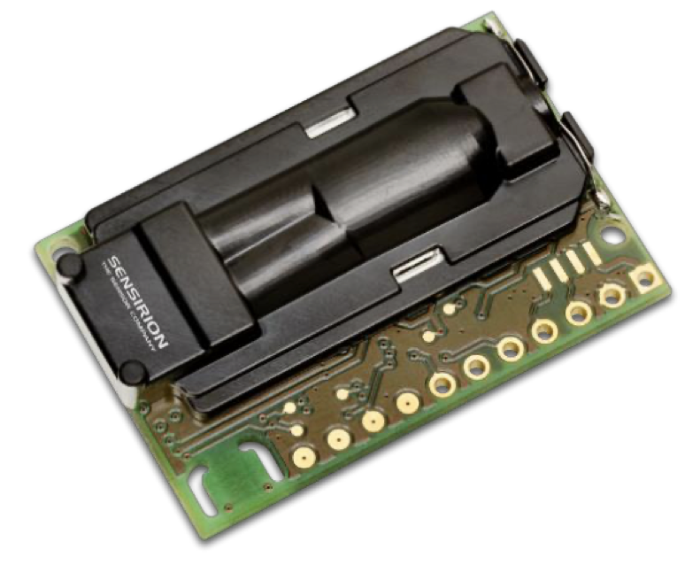
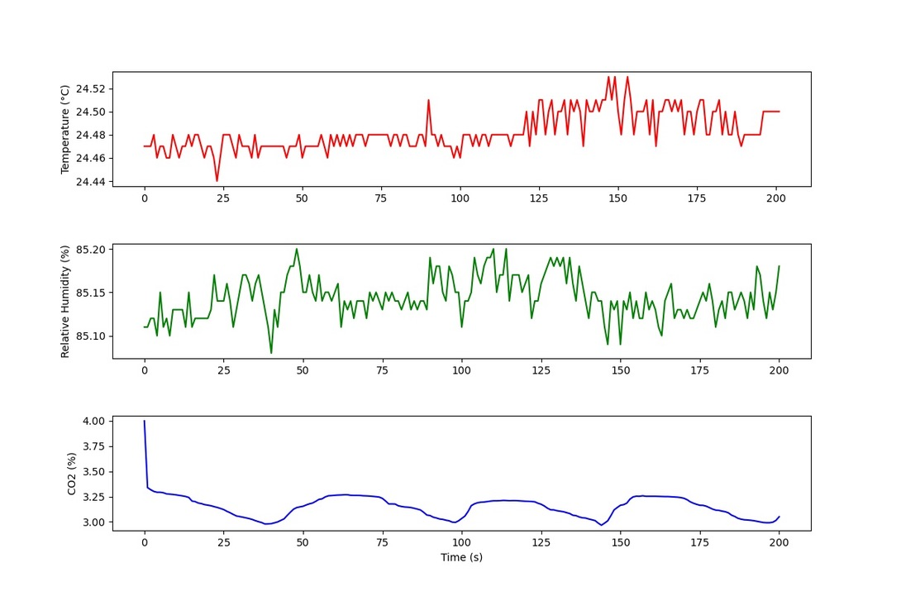

# SCD-30 Carbon Dioxide (CO2) Sensor

Image: The SCD-30 Carbon Dioxide (CO2) Sensor

## Table of Contents

- [Introduction](#introduction)
- [Features](#features)
- [Hardware Requirements](#Hardwarerequirements)
- [Installation](#Installation)

## Introduction

The SCD30 from Sensirion is a high-quality Nondispersive Infrared (NDIR) CO2 sensor with a range of 400 to 10,000 ppm and an accuracy of ±(30 ppm + 3%). It features integrated temperature and humidity sensors, making it a versatile choice for environmental monitoring. The sensor can also be calibrated for altitude and accept ambient pressure readings, further enhancing its precision. To simplify working with the SCD30, an Arduino library is available, making it easy to read CO2, humidity, and temperature data. This library can be downloaded via the Arduino Library manager by searching for 'SparkFun SCD30' or from the Documents tab above.

The SCD30 Humidity and Temperature Sensor is compatible with the OpenLog Artemis datalogger system, allowing for automatic detection, scanning, configuration, and data logging without the need for complex programming or setup.

## Features

- **Power Supply Voltage:** Operates on 3.3V - 5.5V.
- **NDIR CO2 Sensor Technology:** Utilizes Non-Dispersive Infrared (NDIR) technology for accurate CO2 measurements.
- **Integrated Temperature and Humidity Sensor:** Includes a built-in sensor for temperature and humidity readings.
- **Dual-Channel Detection:** Provides dual-channel CO2 detection for superior stability and precision.
- **Compact Form Factor:** Compact dimensions measuring 35 mm x 23 mm x 7 mm.
- **Measurement Range:** Capable of measuring CO2 levels within the range of 400 ppm to 10,000 ppm.
- **Accuracy:** Offers a high level of accuracy with a specification of ±(30 ppm + 3%).
- **Low Current Consumption:** Operates with a low current consumption of 19 mA at a measurement rate of 1 per 2 seconds.
- **Energy Efficiency:** Designed for energy efficiency, consuming only 120 mJ per measurement.
- **Fully Calibrated and Linearized:** Sensor data is fully calibrated and linearized for precise readings.
- **Digital Interface:** Provides the option of digital communication through UART or I2C.

## Hardware Requirements

To kickstart your project, you will need the following hardware components:

- SCD-30 CO2 Sensor
- Arduino board (e.g., Arduino Nano, Seeeduino Xiao)
- Jumper wires
- USB hub

## Installation
**Library Installation**: Install the HTU21D-F sensor library for Arduino. You can achieve this through the Arduino Library Manager. Open the Arduino IDE, navigate to `Sketch > Include Library > Manage Libraries`, search for "SparkFun SCD30 Arduino Library, and then install the library.

Use `co2_meter.py`to plot the data.

